# SEI - Project One - Pacman

## Table of contents

* Project Overview
* The Brief
* Technologies Used
* Approach Taken (featured code)
* Final Product (screenshot walkthrough)
* Wins & Challenges
* Bugs
* Future Content and Improvements
* Key Learnings

## Project Overview
This was my first project whilst on the General Assembly Software Engineering Immersive course. It is a “Theseus and the Minotaur” themed Pacman game which is a grid-based game and utilises JavaScript, HTML and CSS technologies learnt in the first three weeks of the course. 

This was a solo project and the timeframe to complete the project was one week. 

#### Play the game here: [millyarkwright.github.io/pac-man](https://millyarkwright.github.io/pac-man)

## The Brief

Design a grid-based game using HTML, CSS and JavaScript technologies that have been learnt in the first three weeks of General Assembly’s Software Engineering Immersive course. 

Technical Requirements included: 

* Render the game in the browser
* Be build on a grid (HTML Canvas not to be used)
* Design logic for winning and visually display which player won
* Include separate HTML, CSS and JavaScript files
* Use JavaScript for DOM manipulation
* Deploy the game online

Minimum requirements: 

* The player should be able to clear at least one board 
* The player’s score should be displayed at the end of the game

## Technologies Used

#### Languages:
* HTML5
* CSS3
* JavaScript (ES6)

#### Development tools:
* VS Code
* Git & Github
* Google Chrome dev tools
* Trello Board (planning and timeline)
* Excalidraw (wireframing)

## Approach taken (featured code)

### Planning 

Once the project had been introduced and I'd chosen pac-man as my game, I spent the rest of the day brainstorming and planning the project: 

**Trello**
* Created a Trello board, created lists for each day of the project and added the tasks I wanted to complete by each day to the lists. 
* Listed out expected elements I would need to target: 
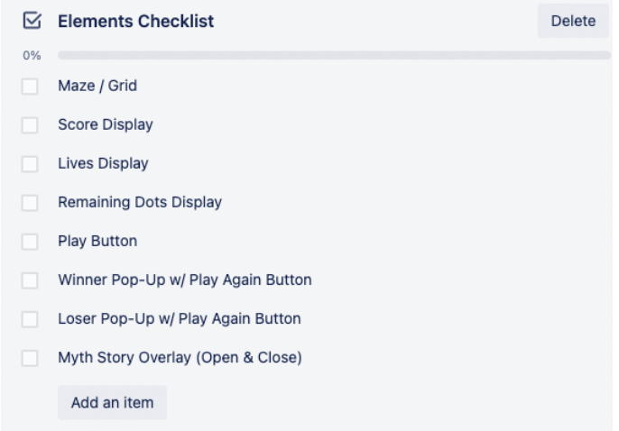
* Listed out expected variables I would need: 
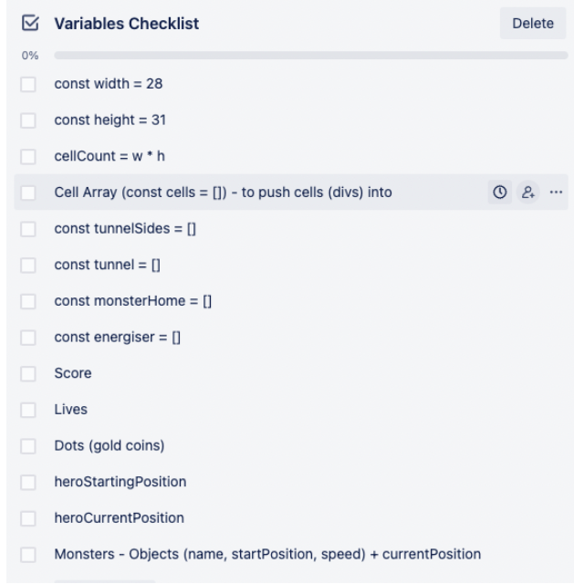
  * Other Variables to be added throughout game: 
    * Point value of dots, energisers & frightened monsters
    * frightenedMode 
    * canLoseLife
* Listed out expected executions:
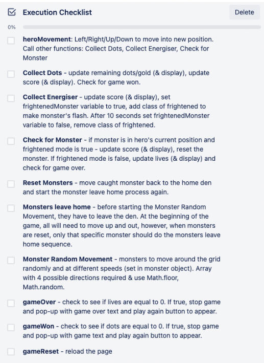
* Listed out expected event listeners: 
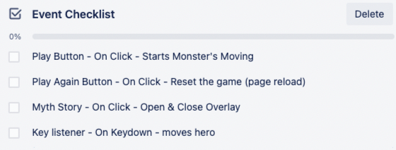

**Excalidraw**
* Created wireframes for the main page as well as win/lose pop-up and myth story overlay: 

*Main Page Layout*
* Play button to start the monster’s movement 
* Click to read the full story `<article>` at the bottom of the intro-wrapper would open a previously hidden  `<section>` that would be overlayed over `<main>`

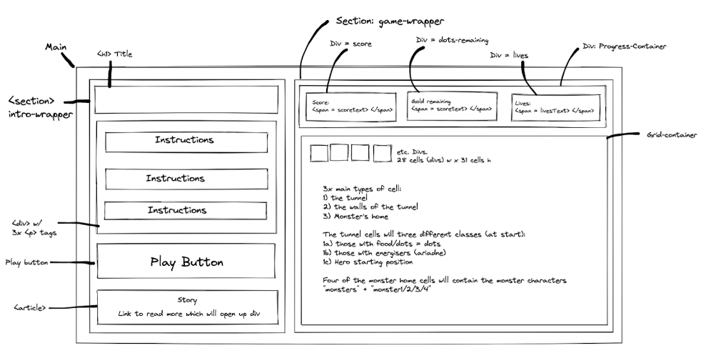

*Myth Story*
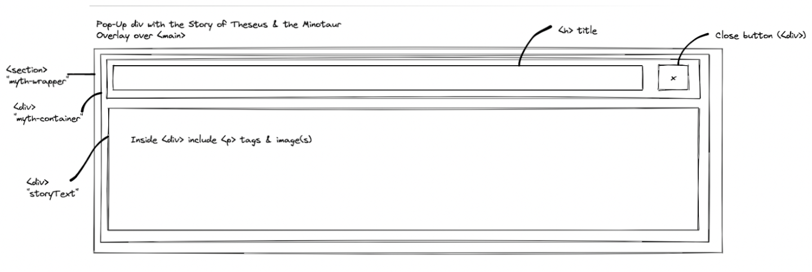

*Win/Game Over*
*Included in the game-wrapper `<section>` but hidden at start. When shown, should replace the grid and progress container. 
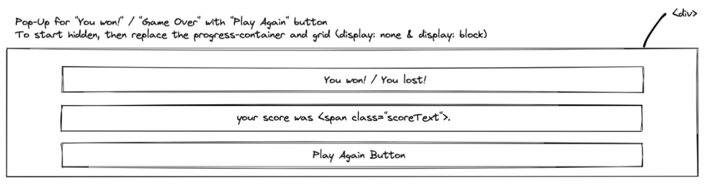

### Code Process

On the second day, I created the grid, added classes to specific cells which were to be used in my CSS and JavaScript functions, and started on the hero movement. 

**Featured Code - Creating the grid**

Once I created a simple page layout with HTML and a little CSS styling, I started on creating the grid in JavaScript using a forLoop and DOM manipulation so I wouldn’t need to hard code over 800 divs in HTML:

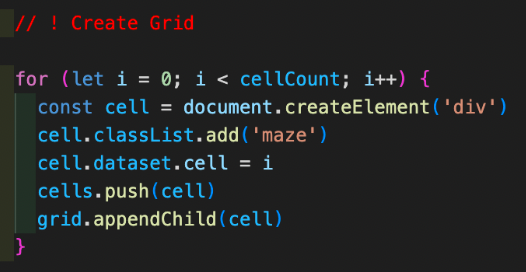

I added a dataset of “index” so it was easy to find the index number of cells; I needed the indexes to create arrays of cells which I could map through and add specific classes that I would use in my CSS and JavaScript. For example: 

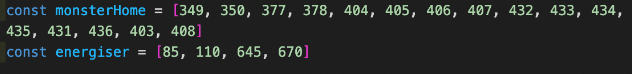
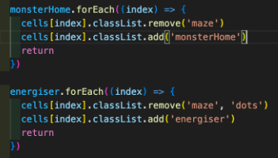

After the grid was created, I started applying some CSS. I decided upon my colour scheme for the grid and found images for my characters - Theseus, Ariadne and the Minotaurs - and gold coins for my dots. These were added to the grid as background-images using the classes I’d added to the grid cells in the previous step (detailed above). 

**Featured Code - Hero Movement**

Using the arrow keys, the Hero was to move around the grid collecting gold coins, energisers catching frightening monsters. I broke this down into four functions; the first being the heroMove function which would subsequently call the other three functions: 

1. **heroMove** - this movement of the Hero is handled by the “keydown” event listener. There are certain cells the hero can’t move into such as the maze walls and the monster’s home so these had to be taken into consideration when writing this function. 
2. **collectDots** - this function checks whether the cell the Hero is currently in contains a dot (i.e. a gold coin). If true, the score and scoreText (displayed above the grid) will be updated and the class ‘dot’ removed from the cell so the gold coin image will disappear. 
    * The gameWon function will also be called here to check whether the number of dots equals 0. 
3. **collectEnergiser** - this function checks whether the cell the Hero is currently in contains an energiser (i.e. Ariadne). If true, the score and scoreText (displayed above the grid) will be updated, the frightenedMode variable will be reassigned to true and a class of ‘frightened’ will be added to the `<body>` element which will trigger the CSS animation making the monster’s flash (screenshot below).  
    * I only wanted the monster’s to be in frightenedMode for 10 seconds so I added a setTimeOut.

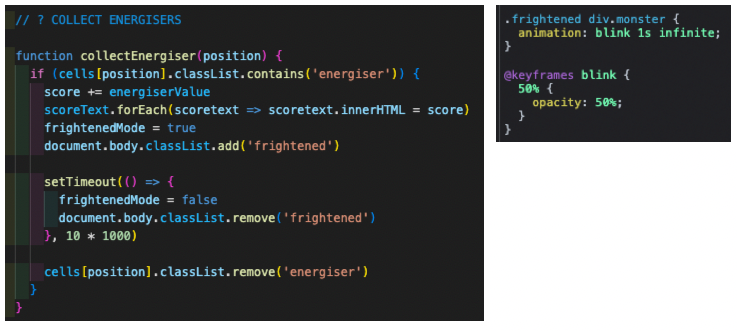

**Featured Code - Check Collision**

This is the fourth function mentioned above and is called in the Hero Movement function as well as in the Monster Movement function. If the hero's position contains a monster or vice versa, the monster would be reset and the score updated if in frightenedMode or the hero would lose a life if not in frightenedMode. 

Lives were being lost too quickly if Hero and Monster remained in the same cell too long so a global variable called canLoseLife and a setTimeOut was added to delay losing a life. After a life was lost, the canLoseLife variable was set to false preventing another life from being lost, using setTimeOut, the variable was set back to true after 0.4 seconds thus allowing another life to be lost. 

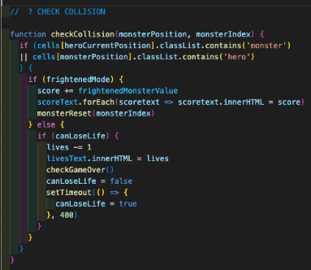

**Featured Code - Monster Movement**

The monsters’ movement is split into two main functions; escaping the pen (escapePen) and moving randomly around the grid (monsterRandomMove). There is also a third function that resets a Monster to its starting position in the pen if caught whilst in the game is in frightenedMode.

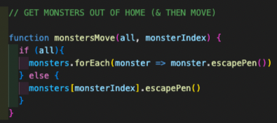

*Monsters Leaving Pen (escapePen)*

The idea here was for each monster to leave the home in turn, each moving up a width every 200 milliseconds. All the monsters will need to move up four cells. The monsters on the left and right need to move one cell right and left (respectively) before moving up so these monsters were given a 1 & -1 value (respectively) for their Object “escape” key. 

If this value for the “escape” key was provided, the move function is called with the value passed in (as the “dif” parameter for the function) and the position of the Monster would move left or right depending on the value passed in. 

If the value for the “escape” key isn’t provided, the Monster will skip this step and move straight to the “leaves” interval which calls the move function passing in “-width” (width being 28 cells) which will move the Monster up one width until the interval is then cleared 800 milliseconds later (the setTimeOut for this interval is 0.8 seconds because the Monsters need to move up 4 cells at a speed of 0.2 seconds. 

At this point, the monsterRandomMove function, which moves the Monsters randomly around the grid, is called.  

Timeouts

* The first setTimeOut is in place to stagger the Monsters leaving the den - the Monster’s Index is multiplied by 800 so each Monster will start escaping the pen every 800 milliseconds. Monster1 will leave the den immediately as its index is 0 and 0 * 800 is 0, whereas Monster 4 will start leaving the den after 2,400 milliseconds as its index is 3 and 3 * 800 is 2,400.
* The second setTimeOut is in place to delay the “leaves” interval (which moves the Monsters up 4 cells) for those Monster’s that have an “escape” value as they have an additional move to make (they need to move into the centre before moving up).
* The third setTimeOut is to clear the “leaves” interval and start moving the monsters randomly around the grid after 800 milliseconds. 

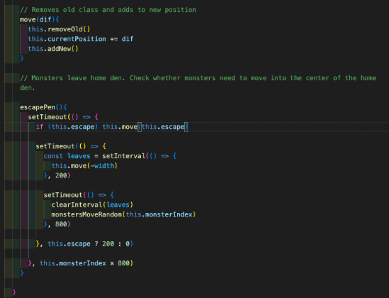

*Monster Random Movement (monsterRandomMove)*

I first needed to create an array of all the directions a monster could move in. Within the monsterRandomMove function, I would then use Math.floor and Math.Random to return a random index from the array and store it in a variable (called monsterRandomDirection). 

To get the monsters to move continuously, I used a setInterval and as I wanted the Monsters to move around the grid at different speeds, I set the speed at which the function was to be executed to the Monsters’ speed which is defined in their respective Objects. 

I needed to ensure that when the interval was cleared in the resetMonster function, it was only cleared for the Monster that had been caught and not all of them. Therefore, I saved it to a property in the Monster Objects (named “timer”) which meant when it came to clearing the interval, I could access the timer key that stored the interval for that particular monster. 

I first wrote this without the While loop but I found the Monsters would often look like they were frozen in one position as they were having to wait for another interval to check whether they could move again and this could happen multiple times. By repeating the check in a While loop, it meant there was a valid move on every iteration of the interval.

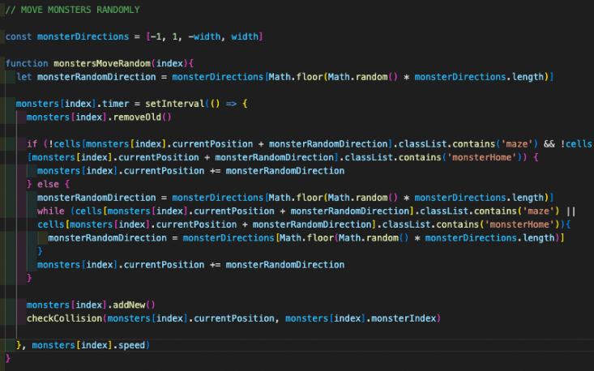

*Monster Reset*

This function is for frightened Monsters that have been caught by the Hero and need to be sent back to the pen.  Firstly the monster’s random movement is stopped by clearing the interval this movement is saved to, then the monster is moved to its starting position (defined in the Monster’s Object). 

In order to ensure only the specific Monster that has been caught is returned to the pen, the Monster’s index is passed into the function. 

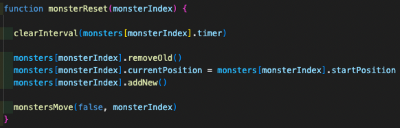

## Wins & Challenges

**Wins**: 

* A big win for me in this project was my increased understanding of JavaScript. 
* Building the game really took me out of my comfort zone and I am really happy - and slightly surpised! - with the end result. 

**Challenges**: 

* **Monster movement once reset**
  * I knew from the start that my main challenge would be the monster movement. I originally wrote all three of the Monster Movement functions detailed above outside of the Monster Class. This worked up until the point of resetting the Monsters; when a Monster was reset, it would cause others to glitch (they would bounce between adjacent cells). This glitch sometimes resolved itself after some time passed or if another Monster entered the same cell. 
  * I disabled all the Monsters apart from one and tested resetting the Monster, everything then worked as expected. I reactivated a second Monster and tested resetting one Monster, this caused the non-reset Monster to glitch. After console.log-ing each part of my Monster Movement function and still not getting to the bottom of the glitch, I decided to try refactoring some of my code. 
  * I started by changing my monstersLeaveHome function to a method (escapePen) in my Monster Class. After updating my monsterMove function to take this change into account, I found to my great relief and joy, that the Monsters were no longer glitching. I found this also allowed me to significantly streamline my code as the methods could access all the relevant information locally. I ended up not refactoring my other Monster Movements functions but I intend to do this at a later date.
* **Monster Random Movement**
  * As mentioned in the Monster Random Movement section in the Code Process above, originally the Monsters looked like they were frozen in the same cell before then moving again. To fix this, I introduced a While Loop so the Monster didn’t need to go through multiple intervals before getting a viable move. Each iteration of the interval would return a valid move. 

## Bugs

* I don't believe there are any bugs to the best of my knowledge. 

## Future Content and Improvements

* Move some of the remaining Monster Movement functions into the Monster Class
* Streamline the code for checking whether the path is clear as it’s needed for both Monster and Hero movement. 
* Add a username input and save the highscores to local storage and display in the game 
* Introduce different monster movement modes (starting with Scatter which may be slightly more achievable). In the original game, there are three modes: 
  * Chase - each ghost has a different “nature” when in chase mode which are “aggressive”, “random”, “patrol” and “ambush” 
  * Scatter - each ghost has a target cell (one in each corner of the grid) they need to need to move towards when in scatter mode
  * Frightened - ghosts aimless wander around the grid 
* Multiple levels which a different greek myth theme such as Hercules and the Hydra and Jason and the Golden Fleece

## Key Learnings

* This first project has shown me the importance of thorough planning, spending more time thinking about the game-flow and doing more pseudo-coding of the functions I expect I’ll need.  
* This project has also taught me that I need to do more refactoring of my code whilst I'm working on a project.

